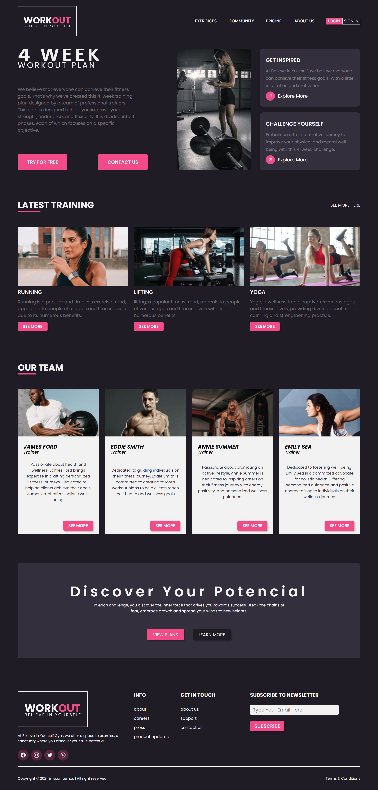

# Believe_in_YourSelf
  

## Ejemplo en vivo
-

## Descripción 📑
 Believe in YourSelf es una web desarrollada en HTML, CSS y JavaScript, Diseñada para reflejar la identidad y valores del gimnasio
 

## Tecnologías 🛠
<!-- Iconos sacados de: https://github.com/hendrasob/badges/blob/master/README.md y https://github.com/alexandresanlim/Badges4-README.md-Profile -->

## Autor ✒️
**Carlos Alberto Bolaño Luna**

* [carlostutos899@gmail.com](carlostutos899@gmail.com)
* [LinkedIn](https://www.linkedin.com/in/carlos-bola%C3%B1o-716926191/)
<!-- * [Porfolio web](https://tu-dominio.com/) -->
